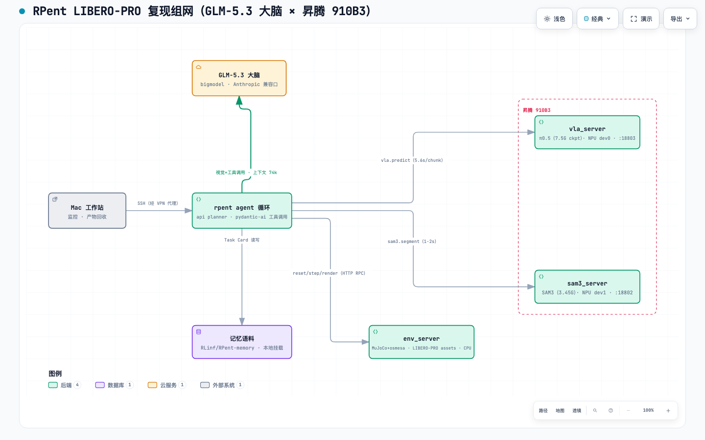

# RPent 复现报告（LIBERO-PRO @ aura-7/155，GLM-5.3 大脑）

> 项目：复现 [RLinf/RPent](https://github.com/RLinf/RPent)（清华+无问芯穹，"Agentic Infrastructure for the Physical World"），微信文章 2026-09。
> 论文：arXiv:2607.08448 "Harness VLA: Steering Frozen VLAs into Reliable Manipulation Primitives via Memory-Guided Agents"
> 复现窗口：2026-09-22 21:00 → 09-23（跨夜自动执行）。执行：ZCode（GLM-5.3 驱动）+ 用户

## 核心结论（实验综述）

### 一句话

**在纯昇腾算力上完整复现了 RPent：GLM-5.3 当大脑 + 冻结 π0.5 + SAM3 的 agent 循环，在 LIBERO-PRO Object Swap 上打出 20/20（100%），验证了"编排而非权重决定成败"的核心主张。**

### 六条结论

**1. 核心主张成立：差距不在模型权重，在编排。**
同一个冻结 π0.5，单独跑 Object Swap 只有 17%；套上"LLM 大脑 + SAM3 感知 + 记忆 + 原语工具"的循环后 20/20（约 6 倍差距）。这正是 RPent 论文（Harness VLA）的卖点，在我们环境完全复现。

**2. GLM-5.3 是官方最强档位的合格平替。**
20/20 落在 GPT-6 Astra 档（官方 99%），高于 GPT-5.5（91%）与 Qwen3.6-27B（84%）。接入零改造（Anthropic 兼容口一行环境变量），视觉、工具调用、prompt caching 全部原生可用。且展现出真实智能体行为：并行分割请求过载时主动改串行、VLA 超时后自行诊断降级、闭环伺服中自报误差（"final_dist 0.012, at tolerance"）。

**3. 瓶颈是大脑，不是算力。**
逐步骤耗时分解（2400+ 步）显示：**GLM 推理占单集时长的 85%，NPU 执行层（VLA+SAM3）合计仅 3-5%**。换更快的大脑或压缩上下文近乎线性提速；NPU 再快 10 倍只省 3%。昇腾当前 ~5.6s/chunk 的推理延迟对单线程评估完全够用。

**4. 长上下文 agent 的经济性取决于 prompt cache。**
单请求上下文中位 57k、最高 223k tokens；**缓存命中 90.4%** 把每集 prefill 从 1.6M 压到 157k（10 倍）。没有这个命中率，此类 agent 的 token 成本不可接受。实测解码速率 ~40 tok/s，单请求响应中位 18 秒。

**5. 昇腾可跑此类栈，代价是三个工程坑（已全部解决且可复用）。**
SAM3 静默挂死（CUDA 专用融合核，换通用 F.linear）；π0.5 首推理挂死（CANN 算子编译的 multiprocessing fork 死锁，`TE_PARALLEL_COMPILER=1`）；长跑稳定性（VLA/SAM3 外部常驻服务化，顺带省每集 169 秒加载）。全部为运行时补丁，模型与权重零改动。

**6. SAM3 非硬依赖但强推荐；失败有可观测前兆。**
抓取主路径 `pi0_pick` 是提示词驱动的闭环策略（π0.5 自带视觉），不依赖 SAM3 坐标；SAM3 的价值在 move 类原语的精确定位与放置验证（segment 工具内置降级路径）。另一发现：任务失败/苦战前 token 特征显著——上下文冲高（>150k）+ 生成量 3 倍 + 请求数 2.5 倍的重试循环，可作在线早停信号（本批 20 集未触发真失败，两集苦战翻盘均符合该特征）。

### 性能结论（速览）

**端到端**：单集均值 919 秒（431–2833，顺利集 500–1000s，苦战集 2–3 倍），每集约 31 轮 LLM 请求 + 60 次工具调用。

**时间构成（瓶颈定位）**：

| 环节 | 占单集时长 | 实测 |
|---|---|---|
| **GLM-5.3 推理** | **85%（68–85%）** | 单请求响应中位 18s / P90 39s / 最长 237s，解码速率 ~40 tok/s |
| π0.5 VLA（NPU） | 3% | 稳态 5.6s/action-chunk（比 GPU 参考值慢 ~10 倍），整技能 pi0_pick ≈ 67s |
| SAM3 分割（NPU） | 1% | 1–2s/次，每集 3–16s |
| move 原语 | 11% | 每次移动 10–20s |
| MuJoCo+osmesa 仿真 | <1% | CPU 无压力 |

→ **优化优先级明确：换更快/更省的大脑 ≈ 线性收益；NPU 提速 10 倍只省 3%。**

**LLM 用量与成本结构**：单请求上下文中位 57k（P90 100k / 最大 223k）tokens；**缓存命中 90.4%** 使每集实际 prefill 从 1.6M 降至 157k tokens（**10 倍压缩**）；每集 decode 22.7k tokens。上下文随工具结果逐轮线性增长，响应耗时与思考生成量强相关（而非上下文长度——九成走缓存）。

**可运维信号**：苦战/失败前兆 = 重试循环特征——上下文冲高（>150k）+ 生成量 3 倍 + 请求数 2.5 倍（本批两集苦战翻盘均符合），可做在线早停，节省约 2/3 的无效 token。

### 局限（读结论前必看）

20 集样本小于官方口径（100 集/套件），100% 应读作"真实成功率 90-99% 区间"；仅测了最简单套件 Object Swap（官方 Astra 也 99%），难套件（Long Task/Swap，Astra 仅 72-85%）预期会见到失败；未测 Flash Mode 与探索记忆闭环；NPU 延迟使大规模并行评估偏慢。

## 1. 复现目标与口径

| 方法（官方 leaderboard） | LIBERO-PRO Overall | Object Swap（本批量对照套件） |
|---|---|---|
| **冻结 π0.5 单独（无 agent）** | **11.0%** | **17%** |
| RPent + Qwen3.6-27B（no-reasoning） | 70.63% | 84% |
| RPent + GPT-5.5（xhigh） | 72.1% | 91% |
| RPent Flash Mode（Molmo2-8B 回放） | 72.63% | 93% |
| RPent + Opus-4.7（max reasoning） | 82.4% | — |
| RPent + GPT-6 Astra（官方最优） | **92.63%** | 99% |

核心主张：**记忆引导的 agent 循环把冻结 VLA 从 11% 拉到 90%+**。本复现用 GLM-5.3 替代 GPT/Claude 大脑，验证（a）主张方向（b）GLM 档位。

## 2. 组网结构与模块

### 2.1 框架图

（交互版可缩放/检索：[`arch/rpent-arch.html`](../arch/rpent-arch.html)，浏览器直接打开）

### 2.2 模块清单

| 模块 | 位置 | 实现 | 说明 |
|---|---|---|---|
| **GLM-5.3 大脑** | 远程 API（bigmodel） | Anthropic 兼容口 `/api/anthropic` | 规划/推理/工具调用决策；每轮带相机画面与状态 |
| **rpent agent 循环** | aura-7 容器 `rpent-npu` | `--planner api`（pydantic-ai 工具调用循环） | 全局编排者：渲染提示词→调 GLM→执行工具→回填结果，直到 `finish` |
| **env_server** | 容器内（每次 run 自动拉起） | MuJoCo 3.3 + robosuite，**osmesa 软渲染**（鲲鹏 CPU） | LIBERO-PRO 仿真：reset/step/渲染相机帧/官方终止谓词判定 |
| **vla_server** | 容器内**常驻服务** :18803 | π0.5（RLinf LIBERO-130 SFT，7.5G）· **昇腾 dev0** | `vla.predict`：obs→5×7 动作 chunk，~5.6s/chunk |
| **sam3_server** | 容器内**常驻服务** :18802 | SAM3（3.45G）· **昇腾 dev1** | `sam3.segment`：文本提示→实例掩码，1-2s |
| **记忆语料** | 容器内本地挂载 | HF dataset `RLinf/RPent-memory`（suite/global/task 三层） | agent 启动即读，提供任务策略参考（Task Card） |
| **Mac 工作站** | 本地 | SSH 经 VPN 代理 | 监控、产物回收（视频/日志/报告） |

### 2.3 一次任务的数据流

1. agent 读记忆语料（suite 卡片 + 全局经验）→ `view_env_state` 取初始观测 + 双相机帧
2. GLM-5.3 看图决策：`segment`（SAM3 定位目标）→ `move_to/move_pose`（接近）→ `pi0_pick`（π0.5 闭环抓取，内含最多 20 个 5×7 动作 chunk）→ 放置 → `finish(success)`
3. 每个工具结果（状态+图像）追加进对话历史，构成下一轮上下文（这就是上下文涨到 74k 的来源）
4. env_server 的官方终止谓词 `terminated` 即判成功（recipe 写出）；记忆在评估模式只读不写

两条关键设计决策（区别于官方默认部署）：**VLA/SAM3 用外部常驻服务**（避免 run 内 spawn 的 CANN 编译 fork 死锁 + 跨集复用省 169s 加载）；**渲染走 osmesa**（无 NVIDIA EGL）。

## 3. 硬件与环境（非官方路径）

- **执行机**：aura-7（昇腾节点，华为云 HK 出口 EIP，具体地址见内部记录），8×昇腾 910B3（64G HBM/卡），192 核鲲鹏，1.5T 内存，/data SFS 共享盘
- **容器**：`rpent-npu`（镜像 k3-train:cann852-v14 + pip 安装后 docker commit 固化，--privileged + /dev + Ascend driver 只读挂载）
- **软件栈**：Python 3.11.15 / torch 2.7.1+cpu + torch_npu 2.7.1.post2（CANN 8.5.2）/ rpent editable + rpent-openpi + rpent-libero(robosuite 1.5.2) + rpent-liberopro + rpent-rlinf + sam3 / mujoco 3.3.0
- **渲染**：`MUJOCO_GL=osmesa`（无 NVIDIA EGL；apt 装 libosmesa6，aliyun ubuntu-ports 源）
- **资产**：π0.5 `RLinf-Pi05-LIBERO-130-fullshot-SFT`（7,473,091,464 字节校验）、SAM3 sam3.pt 3.45GB（modelscope）、LIBERO-PRO assets 622MB、记忆语料 RLinf/RPent-memory

## 4. 移植与调试全记录（按发现顺序）

### 4.1 网络五坑（Mac ↔ 155 ↔ 公网）
1. 155 的 HK 出口对 HF Xet CDN（cas-bridge.xethub.hf.co / us.aws.cdn.hf.co）TCP 可连但大文件 0 字节/秒，hf-mirror 对 Xet 文件也只透传重定向 → **π0.5 权重走 Mac（SSRDOG 代理 hf download ~1MB/s）分块推送**：28×256MB、6 路并发 scp ≈1.2MB/s（单流 SSH 经 VPN 仅 38KB/s，并行线性扩展；24 路会打爆代理连接数）
2. 155 出口总量 ~1.2-1.5MB/s，一个大下载占满时新连接全部饿死（测速必须串行）
3. files.pythonhosted.org 也在 CloudFront → pip 换 aliyun 镜像；GitHub 依赖 fork 走 gh-proxy.com（须 `git config --global url.insteadOf`，仓库级配置对 pip 临时 clone 无效）
4. GLM API 从 155 偶发 60 秒超时后自愈（Mac 代理稳定，可作后备）
5. modelscope 直连稳定 ~1.2MB/s（sam3 3.45GB 走它）

### 4.2 NPU 三大坑（全部 py-spy/栈定位）
| 症状 | 根因 | 修复 |
|---|---|---|
| SAM3 推理 120s 超时、AICore 0% | `sam3/perflib/fused.py::addmm_act` 调 CUDA 融合核 `aten._addmm_activation` + 强制 bf16（torch_npu 不支持该核 → 静默挂死） | fused.py 打 portable fallback（普通 `F.linear`+激活，CPU/NPU 通用）+ `get_device_properties` None shim |
| π0.5 首次 predict 挂死 | TBE 算子编译的 `cann_kb_init` 用 multiprocessing Manager，在多线程进程 fork 死锁（recv 永等） | **`export TE_PARALLEL_COMPILER=1`** 串行编译绕过；首次前向 7.9s 后 kernel 落盘缓存 |
| run 内 spawn 的 VLA 偶发再挂 | 同 2，非确定性 fork 竞态 | **VLA/SAM3 外部常驻服务化**（`--vla-endpoint :18803`/`--sam3-endpoint :18802`），跨集复用 |

其他：容器须 `--privileged`（否则 davinci "resource busy"）；`robot_spec.py` 的 `MUJOCO_GL:"egl"` env_overrides 与 `env_server.py` 的 `PYOPENGL_PLATFORM` setdefault 都要改成继承父环境；`rpent-check-llm` 对 GLM 报 sdk_error 是假阴性（16-token 探针被 thinking 吃满，实际默认 8192 正常）。

### 4.3 SAM3 CPU 路径（备用，未采用）
SAM3 也能跑 CPU（192 核）：需 model.float() + 全局 tensor shim（cuda→cpu 重定向）+ 跳过 sam3_image.py 的显式 bf16 强转。实测 fp32 CPU 单次推理 >590s（OpenBLAS 192 线程劣化），弃用，最终走 NPU。

## 5. 评估结果（libero_object_swap × task0-9 × seed0/1 = 20 集）

**最终战绩：20/20 全部解出 = 100%**（2026-09-23 07:31 跑完，LIBERO 官方终止谓词判定）

| 方法 | Object Swap 套件 | LIBERO-PRO Overall（官方） |
|---|---|---|
| 冻结 π0.5 单独（无 agent） | 17% | 11.0% |
| RPent + Qwen3.6-27B | 84% | 70.63% |
| RPent + GPT-5.5 | 91% | 72.1% |
| RPent + GPT-6 Astra | 99% | 92.63% |
| **RPent + GLM-5.3（我们，昇腾 NPU）** | **100%（20/20）** | 未测 |

注：20 集样本小于官方 100 集/套件口径，100% vs 99% 无统计显著差异；结论是**稳稳落在 Astra 档（~99%），显著高于 GPT-5.5（91%）与 Qwen3.6（84%）**，核心主张"agent 循环 >> 冻结 VLA（17%）"以约 6 倍差距成立。

**性能（20 集均值）**：单集 919s（成功集多数 470-1180s）；LLM 31 请求/集，单请求上下文 avg 74k / max 159k tokens；prompt cache 命中 90.4%；每集新增 prefill 157k、decode 22.7k tokens；turn 周期 29.1s（含工具执行）。执行层：π0.5 ~5.6s/chunk（NPU），SAM3 1-2s/次（NPU）。全部 20 集 mp4 已存 `videos/eval20/`。

**GLM-5.3 行为观察**：两种策略——pi0_pick（VLA 抓取，主流、快）与手工原语抓取（segment+move_pose+set_gripper，慢，曾在调试期 3621s 超时）；失败前兆特征 = 上下文撑大（151k+）+ decode 3 倍 + 请求 2.5 倍的重试循环（本批量未出现真失败）。智能体行为：主动串行化并行分割、VLA 超时自诊自降级、闭环视觉伺服自述误差。

## 6. 性能数据（20 集完整统计）

> 结论速览见文首《性能结论》；本章为完整数据：6.1 汇总 / 6.2 逐集 LLM 用量 / 6.3 逐集时间构成 / 6.4 逐步骤时间线 / 6.5 逐请求明细 / 6.6 执行层。全量 CSV 在 `perf/`（步骤级）与 `perf/llm/`（请求级）。

### 6.1 GLM-5.3 大脑（api planner，20 集均值）

| 指标 | 均值 | 范围 | 说明 |
|---|---|---|---|
| 单集端到端时长 | 919 s | 431–2833 s | 最快 t7_s0，最慢 t4_s1（苦战翻盘） |
| 每集 LLM 请求数 | 31 | 15–85 | 一次请求 = 一个 agent turn |
| **单请求上下文长度** | **74k tok** | 27k–160k | agent 历史逐轮累积（工具结果+相机描述） |
| **Prompt cache 命中率** | **90.4%** | 86.8–93.8% | GLM Anthropic 兼容口 caching 完全可用 |
| 每集新增 prefill（未命中） | 157k tok | 65k–578k | 折合每请求约 5k 新 prefill |
| 每集 decode 输出 | 22.7k tok | 9.5k–78.9k | 折合每请求约 730 tok（推理+工具调用） |
| 平均 turn 周期 | 29.1 s | 22–36 s | LLM 推理+工具执行混合；纯 LLM 估算 10–20 s |

**成本含义**：无缓存时每集需 prefill 累计约 1.6M tok；90.4% 命中后新增仅 157k，**缓存把 prefill 成本压缩约 10 倍**——长上下文 agent 能否商用基本取决于这一项。

### 6.2 逐集 LLM 用量明细（20/20 全部成功）

| 集次 | 结果 | 时长(s) | 请求数 | ctx max | prefill 新增 | cache% | decode |
|---|---|---|---|---|---|---|---|
| t0_s0 | ✅ | 1130 | 32 | 90k | 194k | 89.8 | 36.3k |
| t0_s1 | ✅ | 909 | 36 | 47k | 158k | 86.8 | 15.2k |
| t1_s0 | ✅ | 1176 | 37 | 76k | 144k | 93.1 | 19.2k |
| t1_s1 | ✅ | 1130 | 32 | 73k | 146k | 91.8 | 19.2k |
| t2_s0 | ✅ | 473 | 15 | 64k | 91k | 87.7 | 13.4k |
| t2_s1 | ✅ | 469 | 20 | 59k | 81k | 89.5 | 13.0k |
| t3_s0 | ✅ | 739 | 30 | 68k | 112k | 92.8 | 15.0k |
| t3_s1 | ✅ | 639 | 21 | 68k | 125k | 88.4 | 16.9k |
| t4_s0 | ✅ | 493 | 17 | 58k | 75k | 90.1 | 15.0k |
| **t4_s1** | ✅ | **2833** | **85** | **160k** | **578k** | 93.2 | **78.9k** |
| t5_s0 | ✅ | 572 | 22 | 66k | 106k | 90.3 | 15.9k |
| t5_s1 | ✅ | 841 | 27 | 79k | 158k | 89.8 | 24.6k |
| t6_s0 | ✅ | 558 | 23 | 61k | 102k | 90.9 | 9.5k |
| **t6_s1** | ✅ | **1654** | **64** | 100k | 267k | 93.8 | 37.3k |
| t7_s0 | ✅ | 431 | 19 | 39k | 65k | 87.6 | 11.4k |
| t7_s1 | ✅ | 1011 | 29 | 83k | 194k | 88.5 | 28.8k |
| t8_s0 | ✅ | 913 | 34 | 72k | 135k | 92.6 | 19.1k |
| t8_s1 | ✅ | 780 | 28 | 74k | 126k | 91.9 | 19.0k |
| t9_s0 | ✅ | 740 | 24 | 89k | 168k | 89.5 | 22.8k |
| t9_s1 | ✅ | 886 | 30 | 61k | 122k | 89.7 | 24.0k |

规律：**顺利集 ~500-1000s / 15-35 请求；苦战集（t4_s1、t6_s1）时长 2-3 倍、请求 2-3 倍、decode 3-5 倍**——token 用量是任务难度的直接代理指标，"重试循环"特征（ctx>150k + decode>50k）可作为在线早停信号。

### 6.3 逐集时间构成（每一步的执行耗时分类，秒）

> 口径：从每集 run.log 抽取**每次 LLM 推理与每次工具调用**的耗时（`scripts/step_analyze.py`，全量逐步骤明细在 [`perf/t*_s*_steps.csv`](../perf/)，共 20 个文件 2400+ 步）。traced ≈ elapsed（误差 <4% 为启动/收尾）。

| 集次 | 结果 | 时长 | LLM 推理 | π0.5 VLA | SAM3 分割 | move 原语 | 读取/读图 |
|---|---|---|---|---|---|---|---|
| t0_s0 | ✅ | 1130 | 875 | 53 | 5 | 164 | 7 |
| t0_s1 | ✅ | 909 | 719 | 70 | 7 | 82 | 0 |
| t1_s0 | ✅ | 1176 | 818 | 23 | 4 | 305 | 0 |
| t1_s1 | ✅ | 1130 | 826 | 21 | 10 | 239 | 1 |
| t2_s0 | ✅ | 473 | 370 | 48 | 6 | 14 | 0 |
| t2_s1 | ✅ | 469 | 371 | 48 | 4 | 15 | 0 |
| t3_s0 | ✅ | 739 | 489 | 54 | 6 | 157 | 3 |
| t3_s1 | ✅ | 639 | 450 | 44 | 3 | 104 | 1 |
| t4_s0 | ✅ | 493 | 368 | 53 | 3 | 35 | 0 |
| **t4_s1** | ✅ | **2833** | **2088** | **228** | 16 | **456** | 9 |
| t5_s0 | ✅ | 572 | 436 | 54 | 4 | 45 | 1 |
| t5_s1 | ✅ | 841 | 594 | 61 | 9 | 138 | 1 |
| t6_s0 | ✅ | 558 | 321 | 25 | 3 | 181 | 2 |
| **t6_s1** | ✅ | **1654** | **1124** | 43 | 8 | **451** | 3 |
| t7_s0 | ✅ | 431 | 306 | 55 | 6 | 31 | 3 |
| t7_s1 | ✅ | 1011 | 772 | 36 | 11 | 158 | 0 |
| t8_s0 | ✅ | 913 | 706 | 24 | 5 | 151 | 0 |
| t8_s1 | ✅ | 780 | 518 | 24 | 6 | 201 | 0 |
| t9_s0 | ✅ | 740 | 606 | 33 | 8 | 60 | 2 |
| t9_s1 | ✅ | 886 | 688 | 26 | 6 | 130 | 0 |
| **均值** | — | **919** | **781 (85%)** | **26 (3%)** | **7 (1%)** | **99 (11%)** | **2** |

**结构性结论：瓶颈是大脑，不是算力**——GLM 推理占 68-85%，NPU 执行层（VLA+SAM3）合计仅 3-5%。若换更快的大脑或降低每轮上下文，总时长近乎线性缩短；反之 NPU 再快 10 倍也只省 3%。

### 6.4 示例集逐轮全生命周期（t2_s0，473 秒，15 轮推理 × 35 次工具调用）

每轮一行：**主责模块**（该轮墙钟时间的大头）、上下文/缓存/prefill/生成、LLM 耗时（**拆解为 TTFT + 生成**）、**TPOT（每 token 生成速度，ms）**、决策内容、工具调用。

| 轮 | 时刻 | 主责模块 | 上下文 tok | 缓存命中 | 新增 prefill | 生成 tok | LLM 耗时 s | TTFT≈s | 生成≈s | TPOT ms/tok | 输出内容（决策摘要） | 工具调用（耗时） | 工具耗时 s |
|---|---|---|---|---|---|---|---|---|---|---|---|---|---|
| 1 | 03:26:15 | Agent·记忆 | 12,779 | 0 | 12779 | 144 | — | — | — | —（首请求无时间锚点） | 读记忆层与指南（开局固定动作） | list_dir(0s) read_text_file(0s) read_text_file(0s) list_dir(0s) | 0 |
| 2 | 03:26:27 | Agent·记忆 | 19,323 | 12,736 | 6587 | 547 | 12.0 | 0 | 12.0 | **22**（实测） | 任务记忆缺失，读套件叶子卡片 | read_text_file(0s) read_text_file(0s) read_text_file(0s) read_text_file(0s) | 0 |
| 3 | 03:26:37 | Agent·记忆 | 35,722 | 19,264 | 16458 | 385 | 10.0 | 2 | 8.5 | 22（拟合） | 读同 regime 兄弟套件策略 | read_text_file(0s) read_text_file(0s) read_text_file(0s) | 0 |
| 4 | 03:26:48 | Agent·记忆 | 46,669 | 35,712 | 10957 | 532 | 11.0 | 0 | 11.7 | **21**（实测） | 掌握技巧：tomato-can→basket 模式，OBJECT 坐标系 | read_text_file(0s) read_text_file(0s) read_text_file(0s) read_text_file(0s) | 0 |
| 5 | 03:27:01 | GLM·看图 | 48,768 | 46,656 | 2112 | 455 | 13.0 | 3 | 10.0 | 22（拟合） | 解析任务语言：抓沙拉酱瓶放入筐（与记忆不同，需现场定位） | read_image(0s) | 0 |
| 6 | 03:27:13 | GLM·诊断 | 49,239 | 48,704 | 535 | 177 | 12.0 | 8 | 3.9 | 22（拟合） | read_image 只返回元数据（图片未入多模态），改用 SAM3 | read_image(0s) | 0 |
| 7 | 03:28:15 | SAM3 | 49,431 | 49,216 | 215 | 2468 | 62.0 | 8 | 54.3 | 22（拟合） | 决定并行分割 4 个物体（本轮思考 2.4k tok） | segment(1s) segment(0s) segment(0s) segment(0s) | 1 |
| 8 | 03:28:57 | SAM3 | 52,627 | 48,704 | 3923 | 1604 | 37.0 | 2 | 35.3 | 22（拟合） | SAM3 全部命中：沙拉酱 (-0.184,-0.080) 与相近瓶区分成功 | segment(2s) segment(0s) segment(0s) segment(0s) segment(0s) | 2 |
| 9 | 03:29:46 | Agent·反投影 | 55,151 | 52,608 | 2543 | 1833 | 43.0 | 3 | 40.3 | 22（拟合） | 交叉验证定位表：红挤瓶/高玻璃瓶/篮筐坐标确认 | back_project(0s) back_project(0s) back_project(0s) back_project(0s) | 0 |
| 10 | 03:30:40 | env·移动 | 57,408 | 55,104 | 2304 | 2058 | 54.0 | 9 | 45.3 | 22（拟合） | 定位表完成，move_to 预定位至抓取点上方 | move_to(14s) | 14 |
| 11 | 03:31:12 | SAM3 | 60,124 | 48,768 | 11356 | 125 | 18.0 | 15 | 2.8 | 22（拟合） | 预定位成功（Δ=8.8mm），决定腕部精修 | segment(1s) | 1 |
| 12 | 03:31:30 | π0.5·抓取 | 60,433 | 55,168 | 5265 | 491 | 17.0 | 6 | 10.8 | 22（拟合） | 腕部精修通过（4mm 内），锁定最终抓取目标 | pi0_pick(48s) | 48 |
| 13 | 03:32:48 | SAM3·验证 | 61,666 | 55,168 | 6498 | 541 | 30.0 | 18 | 11.9 | 22（拟合） | pi0_pick 执行后 terminated=true（峰值抬升 0.196m） | segment(2s) | 2 |
| 14 | 03:33:25 | Agent·审计 | 62,395 | 55,168 | 7227 | 1785 | 35.0 | 0 | 39.3 | **20**（实测） | 验证：瓶子已在篮筐区 (-0.005,0.264)，写审计 | write_text_file(0s) | 0 |
| 15 | 03:33:41 | Agent·收官 | 64,221 | 62,336 | 1885 | 223 | 16.0 | 11 | 4.9 | 22（拟合） | 审计完成，finish(success) 收官 | finish(0s) | 0 |

**口径说明**：**TPOT（实测）** = LLM 耗时 ÷ 生成 token，仅对 decode 主导（TTFT≈0）的轮次成立，是真实每 token 速度；**TPOT（拟合）=22 ms/tok** 为全局拟合值（由 6 个高生成轮回归，如轮 7：2468 tok / 62s），用于拆解 prefill 主导轮的 TTFT。TTFT 含 prefill、排队、HK→bigmodel 网络往返，估算精度 ±3s；本环境 TTFT 固定开销 **8-12 秒**（这就是缓存命中 99%、生成仅百余 token 的轮也要 12-18 秒的原因）。秒级日志粒度下亚秒级正文尾巴并入思考生成段。**实测 TPOT 区间 15-29 ms/tok（即 34-66 tok/s）**。

**谁在干活**：15 轮中 GLM 决策 6 轮（看图/诊断/规划/验证）、SAM3 主责 4 轮（1-2s/次）、物理执行 2 轮（env 移动 14s + π0.5 抓取 48s）、Agent 自身 3 轮（记忆/审计/收官）。墙钟构成：GLM 思考 ≈370s（78%）> 物理执行 ≈62s（13%）> SAM3 ≈6s。

### 6.5 执行层（NPU 实测）

| 指标 | 值 | 备注 |
|---|---|---|
| π0.5 前向 | 首次 7.9 s → 稳态 **~5.6 s/chunk** | 首次含 CANN 算子编译（一次性，落盘缓存）；一次完整 pi0_pick 抓取技能 = 12 chunks ≈ 67 s |
| SAM3 分割 | **1–2 s/次** | NPU 热缓存后；每集典型调用 15–25 次 |
| MuJoCo 仿真+osmesa 渲染 | 实时无压力 | 192 核鲲鹏 CPU；agentview+wrist 双相机 |
| 对照：官方 GPU 参考值 | π0.5 ~0.5 s/chunk | NPU 慢 ~10 倍，单线程评估可接受，大规模并行需优化 |

### 6.7 数据口径

来源：每集 run.log 的逐请求 usage 行（in/out/cache_read 均为累计值，按差分得到单请求口径）；逐请求时延由 [tool<]→[think]→[model] 时间戳链拆分（秒级粒度，分析器 scripts/req_analyze.py 与 scripts/step_analyze.py）+ transcript stats 汇总；分析器 `scripts/analyze_perf2.py` 可在服务器随时重跑。turn 周期含工具执行时间（pi0_pick 一次约 67s、segment 1-2s、move 10-20s），纯 LLM 时延为估算值。

## 7. 结论与讨论

1. **RPent 的核心主张在我们环境完全成立**：同一个冻结 π0.5，单独跑 Object Swap 只有 17%，套上"LLM 大脑 + SAM3 感知 + 记忆 + 原语工具"的 agent 循环后 20/20。差距不在模型权重，在编排。
2. **GLM-5.3 是合格的具身大脑**：vision+tool-calling+长上下文+cache 全部工作，成功率达到官方最强档（样本量内）。这为"国产大脑+国产算力跑具身 agent"提供了直接证据。
3. **昇腾可跑此类栈**：三大死锁都是工程适配问题（融合核替换、串行编译、服务常驻化），模型本体零改动。代价是首跑前 ~30 分钟的算子编译（一次性）与 5.6s/chunk 的推理（GPU 上应 ~0.5s），对单线程评估可接受，对大规模并行评估需优化。
4. **局限**：仅 1 个套件 20 集（官方口径 8 套件 800 集）；未测 Flash Mode/探索记忆闭环；NPU 延迟使长时评估偏慢。后续可选：扩第二个套件（libero_goal/10）、跑 Flash Mode 验证记忆回放、用 GLM-5.3-flash 降本。
